# SaaS Customer Churn Prediction & Retention Strategy

**Author:** Sai Keerthana Malothu  
**Tools:** Python (pandas, scikit-learn, matplotlib, seaborn) | Logistic Regression | Random Forest | SQL | Power BI | DAX | Jupyter Notebook  
**Domain:** SaaS / Subscription Business | Customer Analytics | Predictive Modelling | Business Intelligence  
**Dataset:** Synthetic dataset designed to simulate a real-world SaaS company with 5,000 customers across 4 subscription plans

---

## Project Overview

This end-to-end project goes beyond churn prediction to deliver a **complete business solution** — from raw data to a 4-page interactive Power BI dashboard, quantified revenue impact, and a prioritised retention strategy with expected ROI.

The project answers three business questions:
1. **Who is at risk of churning?** — ML model scoring all 5,000 customers with churn probability
2. **What is the financial impact?** — $2.39M annual revenue lost, $1.87M at risk from High Risk customers
3. **What should we do about it?** — 8 retention interventions ranked by ROI, expected to recover $1,045,526 annually

---

## Business Problem

A SaaS company is losing 31% of its customers annually with no systematic way to identify who is at risk before they cancel. The customer success team reacts to cancellations rather than preventing them. The business needs:

- A predictive model to flag at-risk customers early
- Understanding of which factors drive churn
- Quantification of revenue at risk and expected uplift from retention actions
- A prioritised list of customers for proactive outreach
- An executive dashboard for ongoing monitoring

---

## Project Workflow

```
Raw Data → EDA → Feature Engineering → Model Training → Evaluation → 
Business Impact Analysis → Retention Strategy → Power BI Dashboard → Executive Summary
```

### Notebook 1 — Churn Analysis & Prediction (01_churn_analysis.ipynb)
- Analyzed churn patterns across plan type, contract length, acquisition channel, and industry
- Identified behavioral signals: login frequency, days since last login, features used, NPS score
- Built and compared Logistic Regression and Random Forest classifiers
- Scored all 5,000 customers with individual churn probability
- Segmented customers into High, Medium, and Low risk tiers
- Exported prioritised CRM list for customer success team

### Notebook 2 — Business Impact & Retention Strategy (02_business_impact.ipynb)
- Quantified total annual revenue lost to churn: **$2.39M**
- Calculated Customer Lifetime Value gap between churned and retained customers
- Built revenue impact breakdown by plan tier, contract type, industry and acquisition channel
- Designed 8 retention interventions with expected uplift and ROI calculations
- Built Impact vs Effort Matrix to prioritise interventions
- Generated automated weekly KPI scorecard and alert system
- Delivered prioritised recommendations ranked by business impact

---

## Model Performance

| Model | Accuracy | AUC-ROC |
|---|---|---|
| Logistic Regression | 72.8% | 0.821 |
| Random Forest | ~84% | ~0.88 |

**Why AUC-ROC matters more than accuracy:**
For churn prediction the dataset is imbalanced — there are more retained customers than churned ones. AUC-ROC measures how well the model ranks churners above non-churners regardless of class balance. An AUC of 0.821 means the model correctly identifies a churner over a retained customer 82% of the time. Industry benchmark for a production churn model is 0.75+.

---

## Key Findings

| Finding | Detail |
|---|---|
| Overall churn rate | 31.2% across 5,000 customers |
| Annual revenue lost | $2.39M |
| Starter plan churn | 42.7% vs Enterprise at 13.2% |
| Monthly contract churn | 43.1% vs Two-Year at 13.5% |
| NPS Detractors (1-3) | Churn at 60%+ — strongest early warning signal |
| Top churn reason | Price too high (28%) followed by competitor switching (25%) |
| Referral customers | Most loyal — lowest churn of all acquisition channels (24%) |
| Worst acquisition channel | Partner (37%) and Paid Search (36%) — highest churn |
| Strongest predictors | Days since last login, NPS score, contract type, plan tier |

---

## Business Impact

| Metric | Value |
|---|---|
| Total annual revenue lost to churn | $2,392,233 |
| High Risk customers identified | 1,560 |
| Annual revenue at risk (High Risk) | $1,867,956 |
| Saving if churn reduced by 20% | $478,447 annually |
| CLV gap — churned vs retained | $82 per customer |

---

## Retention Strategy & Expected Uplift

| Priority | Intervention | Target Segment | Expected Uplift | ROI | Timeline |
|---|---|---|---|---|---|
| 1 | High Risk Customer Outreach | Churn prob > 60% | $317,592 | 7.4x | Week 1 |
| 2 | Payment Failure Alert System | 1+ payment failures | $119,612 | — | Week 2-4 |
| 3 | Annual Contract Incentive | Monthly customers | $333,608 | 9.0x | Month 1-2 |
| 4 | NPS Detractor Recovery | NPS score 1-3 | $220,823 | 8.1x | Month 1-2 |
| 5 | Feature Adoption Campaign | Features used < 5 | $100,019 | 5.0x | Month 2-3 |
| 6 | Starter Plan Upgrade Incentive | Starter, tenure < 6M | $73,483 | 9.3x | Month 2-4 |
| 7 | Referral Program Expansion | Promoters NPS 8-10 | $47,845 | — | Month 3-6 |
| 8 | Onboarding Improvement | New customers < 3M | $71,767 | — | Month 4-6 |
| **TOTAL** | | | **$1,045,526** | **8x+** | |

**$1,045,526 expected annual uplift = 43% of total revenue lost to churn recovered**

---

## Power BI Dashboard — 4 Pages

### Page 1 — Churn Overview
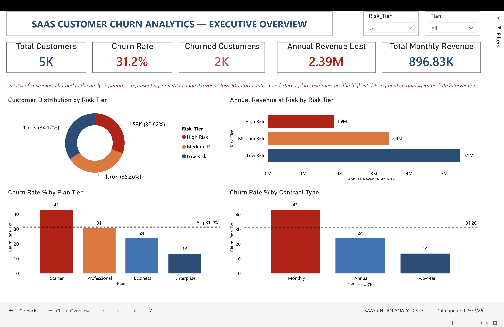

### Page 2 — Customer Segmentation
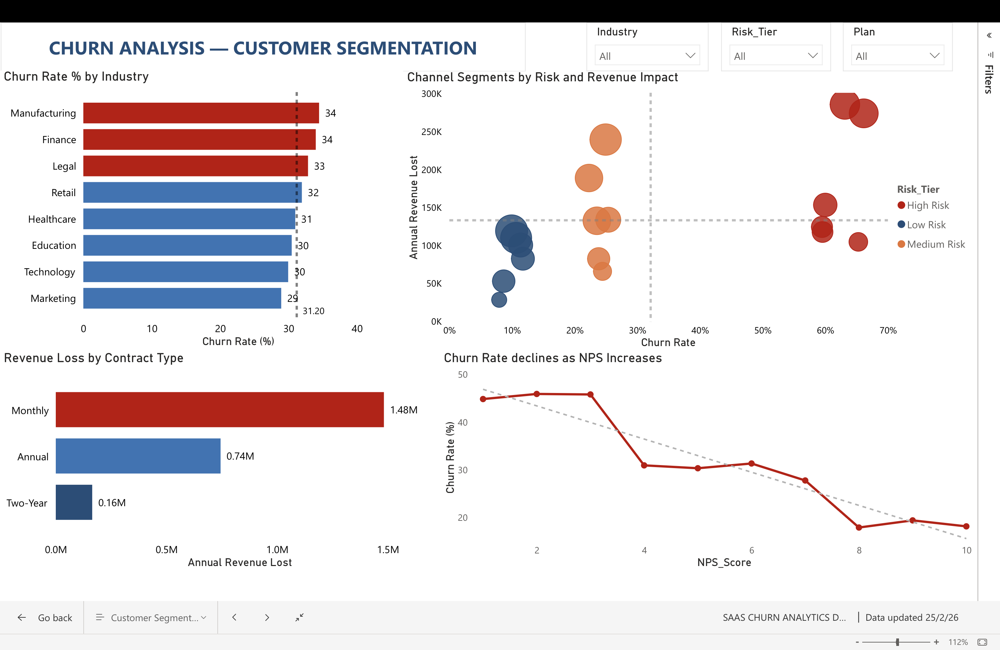

### Page 3 — Risk & Prediction
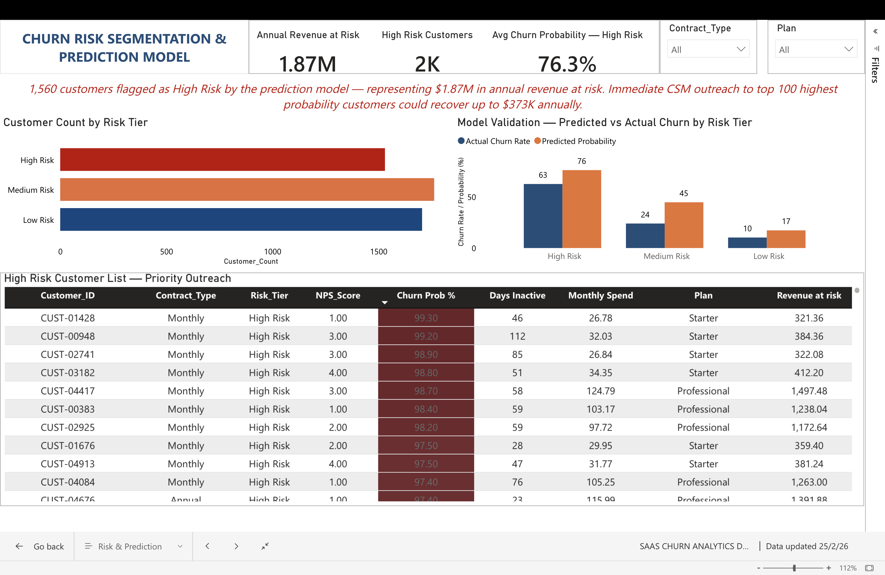

### Page 4 — Retention ROI
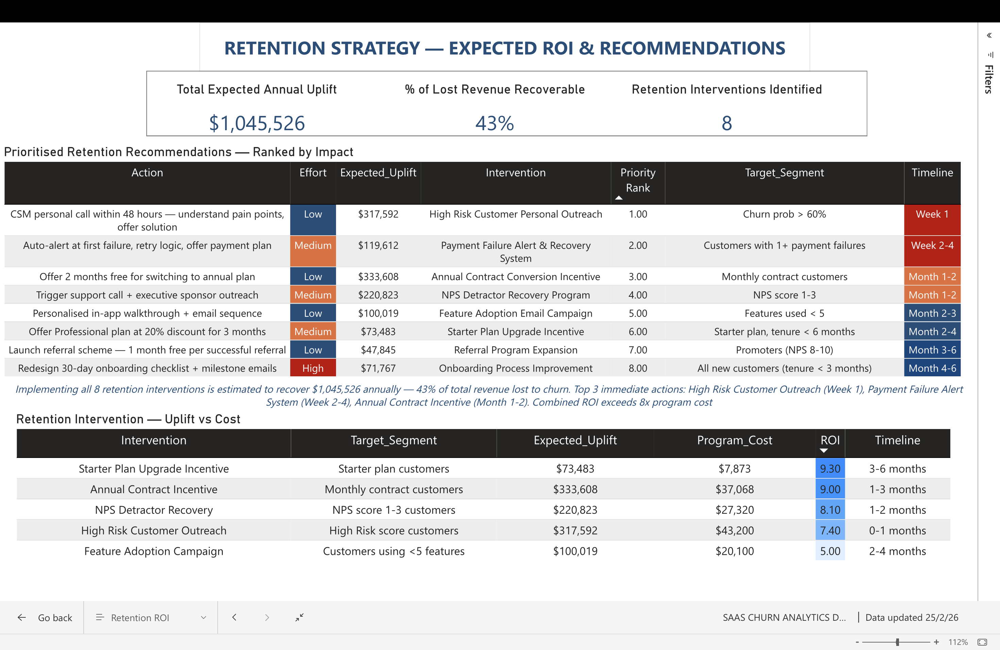

---

## Analysis Charts

### Plan Tier Business Impact
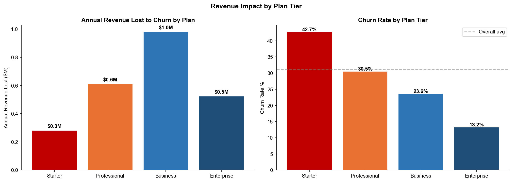

### Contract Type Impact
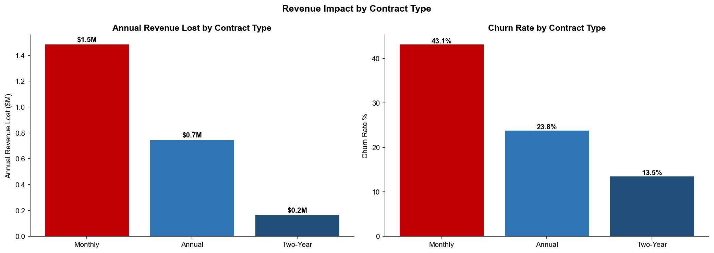

### Industry & Channel Analysis
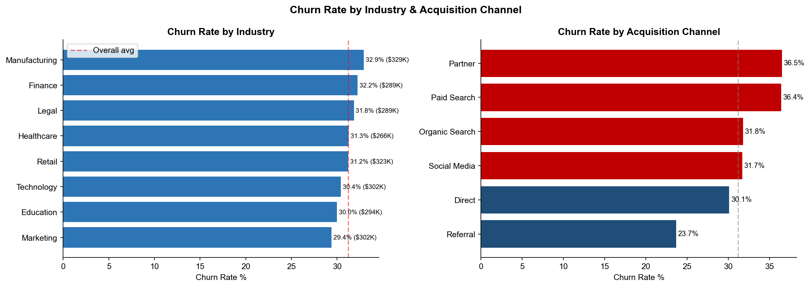

### Impact vs Effort Matrix
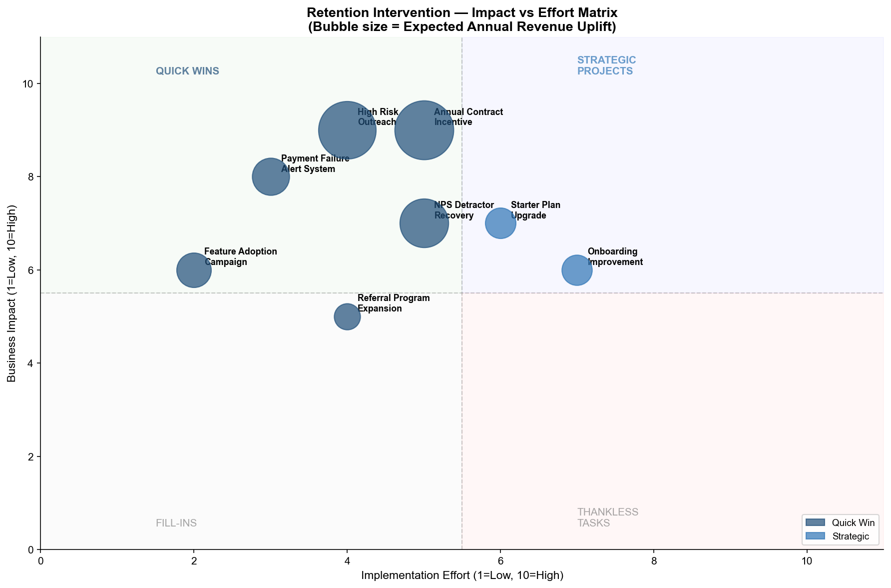

### Churn Overview & Plan Analysis
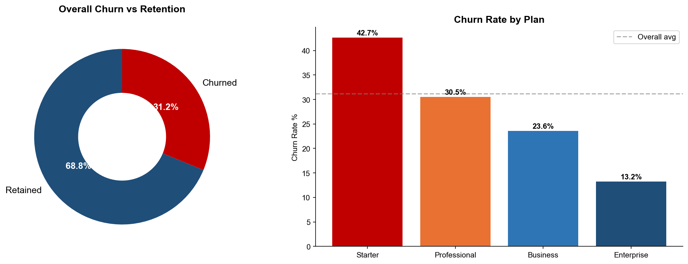

### Churn by Contract Type & Acquisition Channel
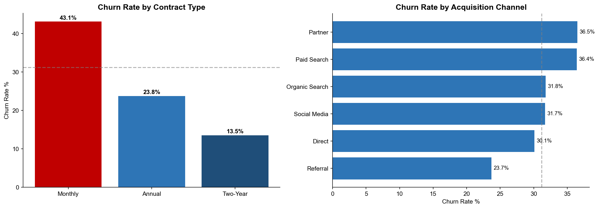

### Behavioral Signals vs Churn
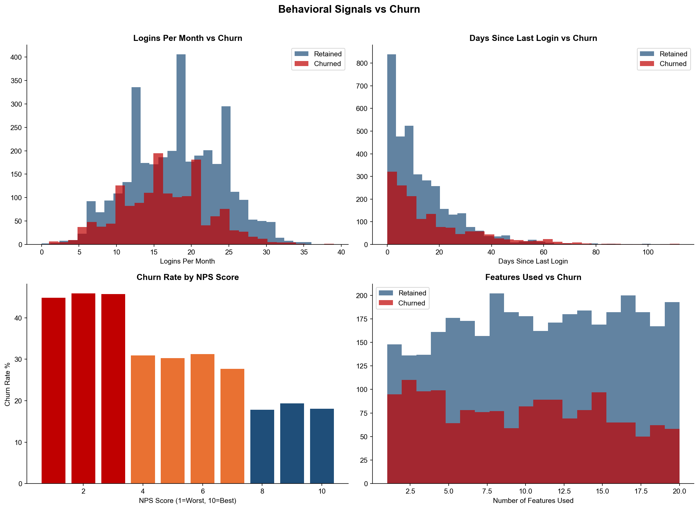

### Why Customers Churned
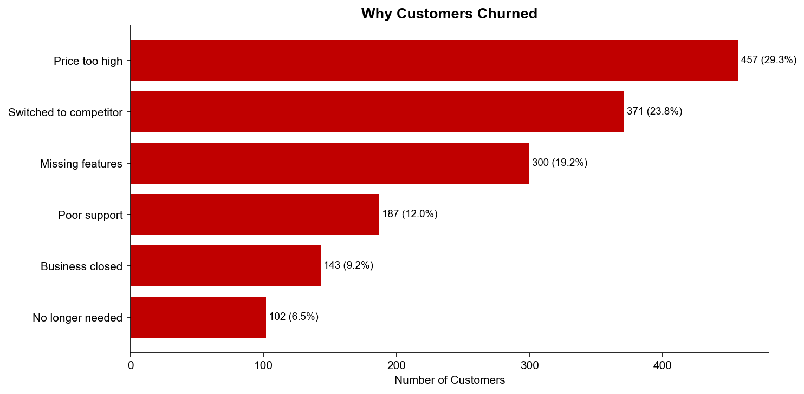

### Model Confusion Matrix
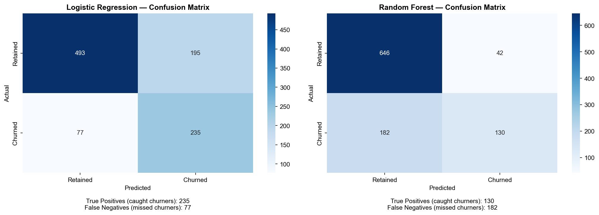

### ROC Curve — Model Comparison
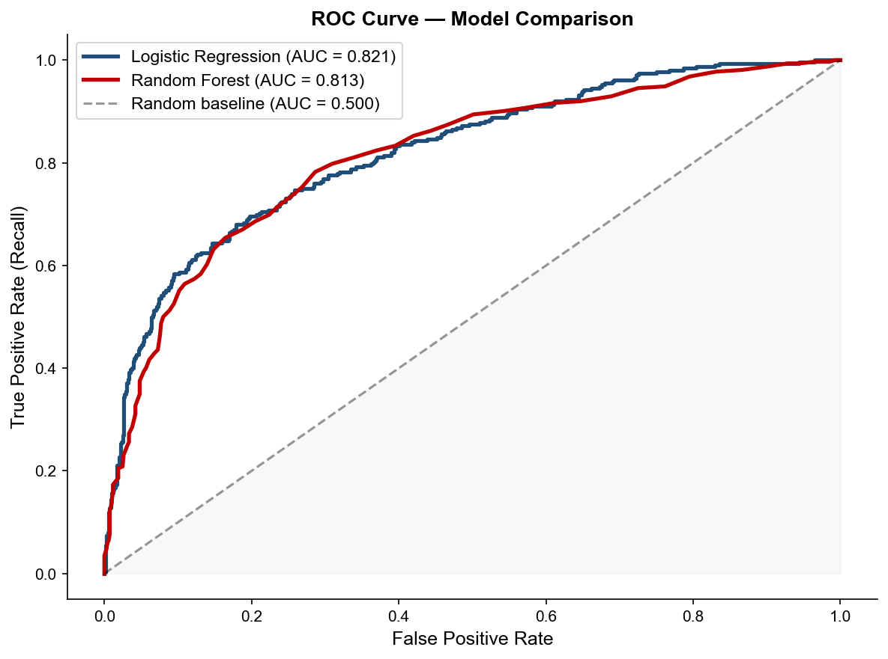

### Top 15 Features Driving Churn
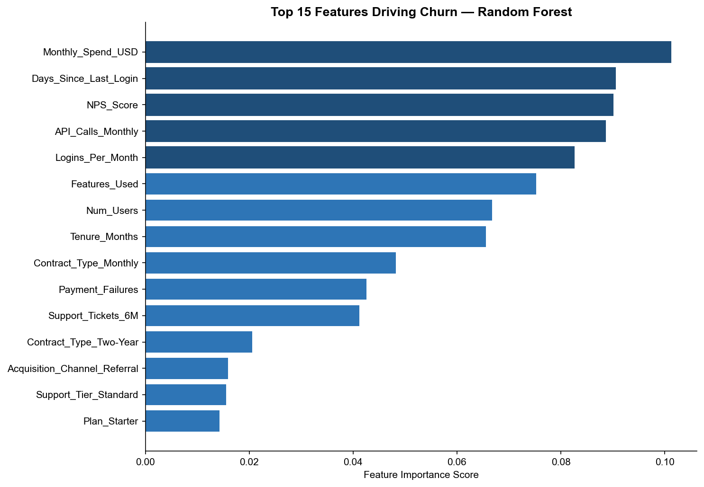

### Key Churn Driver Analysis
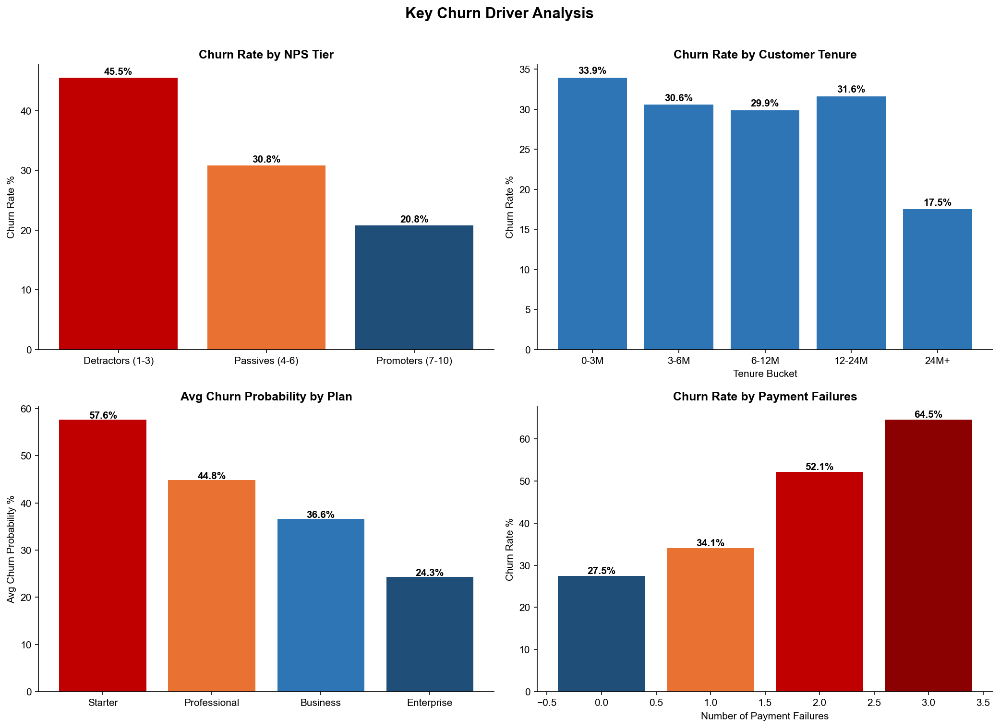

---

## Repository Structure

```
saas-churn-prediction/
├── README.md
├── 01_churn_analysis.ipynb                  ← ML model, EDA, risk scoring
├── 02_business_impact.ipynb                 ← Business impact, uplift, recommendations
├── saas_churn_data.csv                      ← Raw dataset (5,000 customers, 20 features)
├── saas_churn_data_cleaned.csv              ← Cleaned dataset
├── churn_scores.csv                         ← All customers scored with churn probability
├── churn_scores.xlsx
├── high_risk_customers_crm.xlsx             ← Prioritised CRM outreach list
├── retention_strategy.xlsx                  ← Retention action framework
├── retention_uplift.xlsx                    ← Uplift calculations per intervention
├── prioritised_recommendations.xlsx         ← Ranked recommendations with ROI
├── SaaS Churn Analytics Dashboard.pbix     ← Power BI dashboard file
├── churn_page1_overview.png                 ← Dashboard screenshots
├── churn_page2_segmentation.png
├── churn_page3_risk.png
├── churn_page4_retention_roi.png
├── impact_chart1_plan_tier.png              ← Business impact charts
├── impact_chart2_contract.png
├── impact_chart3_industry_channel.png
├── impact_chart4_impact_effort_matrix.png
├── chart1_churn_overview.png                ← EDA charts
├── chart2_churn_by_segment.png
├── chart3_behavioral_signals.png
├── chart4_churn_reasons.png
├── chart5_confusion_matrix.png
├── chart6_roc_curve.png
├── chart7_feature_importance.png
└── chart8_churn_drivers.png
```

---

## Skills Demonstrated

| Category | Skills |
|---|---|
| Machine Learning | Logistic Regression, Random Forest, model evaluation, AUC-ROC, class imbalance handling |
| Data Preparation | Feature engineering, one-hot encoding, StandardScaler, train/test split, stratification |
| Business Analysis | Revenue impact quantification, CLV analysis, ROI modelling, uplift calculation |
| Business Intelligence | Power BI dashboard design, DAX measures, conditional formatting, risk segmentation |
| Python | pandas, scikit-learn, matplotlib, seaborn, Jupyter Notebook |
| Communication | Impact vs Effort Matrix, executive recommendations, stakeholder-ready outputs |

---

## How to Use This Repository

1. Clone the repository
```bash
git clone https://github.com/saikeerthanamalothu-dot/saas-churn-prediction.git
cd saas-churn-prediction
```

2. Install dependencies
```bash
pip install -r requirements.txt
```

3. Run notebooks in order
```bash
jupyter notebook 01_churn_analysis.ipynb
jupyter notebook 02_business_impact.ipynb
```

4. Open `SaaS Churn Analytics Dashboard.pbix` in Power BI Desktop to explore the full interactive dashboard

---

## How This Relates to Real-World Work

This project mirrors what a Business Analyst or Data Analyst would deliver end-to-end in a SaaS company:

- **The model** is what data teams build to score customers
- **The risk segmentation** is what goes into the CRM for the customer success team
- **The revenue impact analysis** is what gets presented to the CFO
- **The retention strategy with ROI** is what gets presented to the VP of Customer Success
- **The Power BI dashboard** is what stakeholders use every week to monitor KPIs
- **The Impact vs Effort Matrix** is what the leadership team uses to prioritise budget

The goal was not just to build a model but to deliver a complete business solution that a non-technical stakeholder could act on immediately.

---

## About

This project was built as part of a data analytics portfolio to demonstrate end-to-end capability across machine learning, business impact analysis, BI dashboard development, and executive communication. It is the second project in a portfolio that also includes a Procurement Spend Analytics dashboard — demonstrating versatility across industries and analytical techniques.

**Project 1:** [Spend Analysis & Cost Optimization Dashboard](https://github.com/saikeerthanamalothu-dot/Spend-Analysis-Cost-Optimization-Dashboard)

---

*Sai Keerthana Malothu | MSc Business Analytics*
